# Project 77 - Reviewer Tracking Evaluation for OJS

This project extends an existing plugin for Open Journal Systems (OJS) to support reviewer tracking and evaluation within a group-based peer review process. OJS does not natively support group review workflows, meaning reviewer participation and contribution data must currently be managed manually outside of the system.

This plugin addresses that gap by providing tools to record reviewer activity during and after group review meetings, monitor reviewer participation and workload at both the individual and journal-wide level, and generate end-of-year reviewer references.

This project is being undertaken as part of RMIT University's Programming Project 1 capstone course.

[](https://github.com/ojs-capstone-77/project77-reviewer-tracking/actions/workflows/lint.yml)

## Contents

1. [Installing](#1-installing)
2. [Plugin setup](#2-plugin-setup)
3. [Developer tooling](#3-developer-tooling)
4. [Workflows](#4-workflows)
5. [Common commands](#5-common-commands)
6. [Plugin usage](#6-plugin-usage)

## 1. Installing

These commands are run inside WSL terminal

### Prerequisites

- Docker Desktop is set up
- WSL Ubuntu is installed
- Ensure WSL extension is already installed in VSCode
- `composer` is installed inside WSL

```
sudo apt update
sudo apt install composer
```

### Clone the repository

```
git clone https://github.com/ojs-capstone-77/project77-reviewer-tracking.git
cd project77-reviewer-tracking/
code .
```

Install recommended extensions (search for `@recommended` inside VSCode extensions search box)

### Clone OJS source files into repository directory

`git clone --branch 3_4_0-10 --depth 1 --recurse-submodules --shallow-submodules https://github.com/pkp/ojs.git ojs-src`

### Composer install dependencies for OJS source files

`composer install -d ojs-src/lib/pkp --ignore-platform-reqs`

### Composer install project dependencies (php-cs-fixer, PHPStan)

`composer install`

### Build from Dockerfile and create containers

`docker compose up --build -d`

If you previously installed you might also need to do `docker compose down -v` to delete old volumes.

### Verify .env variables and run install script

`cat .env`

`./install.sh` (may take a minute)

If you get an error try doing `chmod +x install.sh`

You can also visit http://localhost:8080 and install manually.

## 2. Plugin setup

### Create a journal

Login to OJS with credentials defined in `.env`

Create a Journal

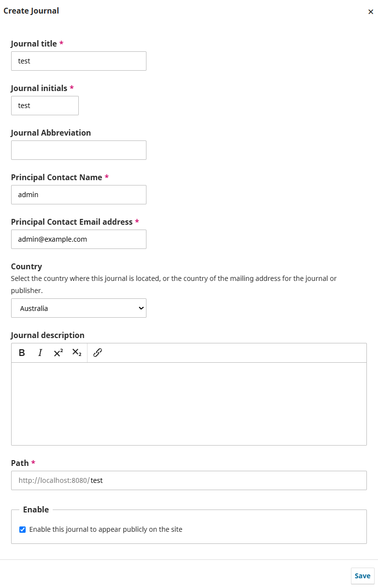

### Enable the plugin

http://localhost:8080/test/management/settings/website#plugins

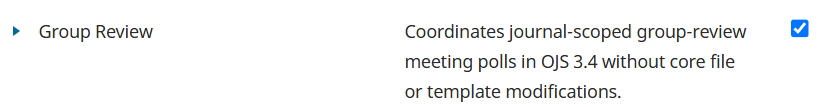

And enable the plugin in settings also

http://localhost:8080/test/management/settings/workflow#review

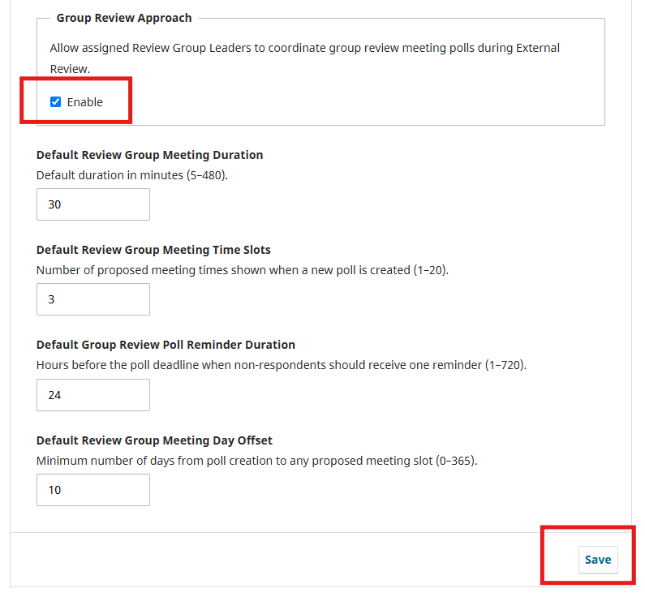

### Create required user roles

http://localhost:8080/test/management/settings/access#roles

The plugin requires these two roles to exist on the journal.

Role for **Review Group Leader**

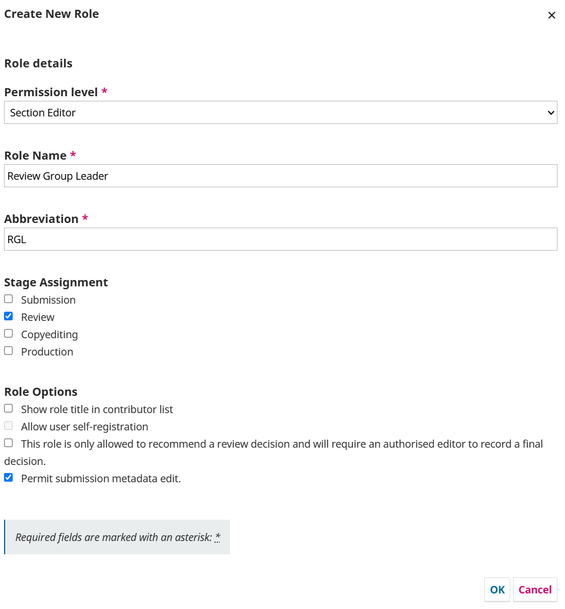

Role for **Review Group Member**

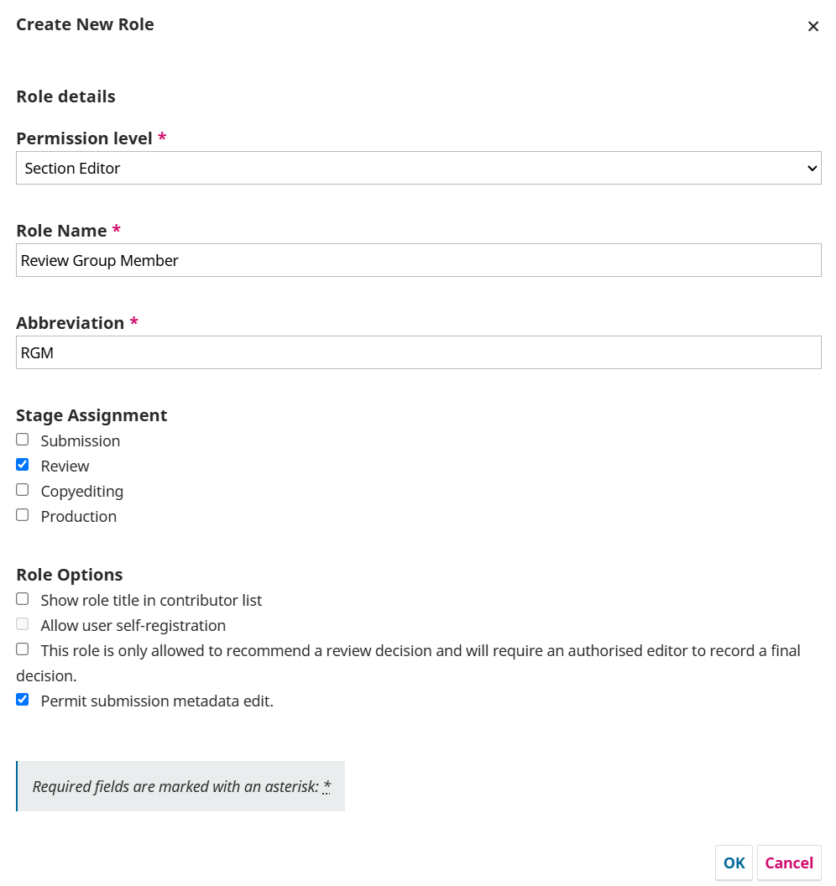

## 3. Developer tooling

The tooling this repo already has set up.

### Editor extensions

| Tool | Purpose | Extension | Relevant files |
| --- | --- | --- | --- |
| PHP formatting | `php-cs-fixer`, rules copied from `ojs-src/lib/pkp/.php_cs_rules`. Checked by CI, auto applied on save | `junstyle.php-cs-fixer` | `.vscode/settings.json`, `composer.json`, `.php-cs-fixer.php` |
| Editor config | Consistent charset/line endings/indentation for non-PHP files (yml, json, md) | `editorconfig.editorconfig` | `.editorconfig` |
| GitHub Actions | View CI run status and logs in VSCode | `github.vscode-github-actions` | `.github/workflows/lint.yml` |
| PHP linting | PHPStan static analysis, catches type errors and logic bugs. Checked by CI | `sanderronde.phpstan-vscode` | `composer.json`, `phpstan.neon`, `phpstan-stubs/` (corrects inaccurate `ojs-src` type annotations) |
| PHP IntelliSense | Autocomplete, go-to-definition, hover docs | `bmewburn.vscode-intelephense-client` | `.vscode/settings.json`, `ojs-src/` |
| Smarty templates | Support for `.tpl` files | `aswinkumar863.smarty-template-support` | — |
| Locale files | Support for plugin `.po` files | `mrorz.language-gettext` | — |
| XML files | Support for plugin XML files, via an XML catalog pointing at the DTDs bundled in `ojs-src/lib/pkp/dtd` | `redhat.vscode-xml` | `.vscode/settings.json`, `.vscode/xml-catalog.xml` |
| Container management | View status/logs, restart, and exec into containers from VSCode | `ms-azuretools.vscode-containers` | `docker-compose.yml` |

All recommended via `.vscode/extensions.json`.

### Debugging

XDebug is installed in both VSCode and the app container, so it needs setup on both sides. Breakpoints work inside `groupReview/` and `ojs-src/`.

Extension: `xdebug.php-debug`

Relevant files: `.vscode/launch.json`, `Dockerfile` (installs Xdebug into the app container), `config/xdebug.ini`

<a href="docs/images/readme/xdebug.png">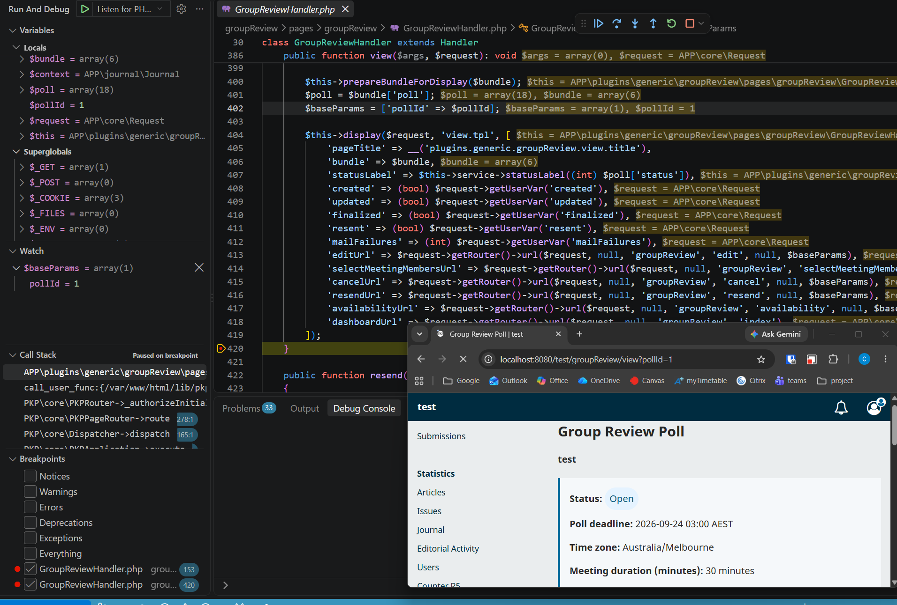</a>

### Container features

| Feature | Purpose | Relevant files | Preview |
| --- | --- | --- | --- |
| Plugin live reload | `groupReview/` on the host is mounted into the app container at `/var/www/html/plugins/generic/groupReview`. Edits to PHP, `.tpl` and `.css` files are picked up by refreshing the browser | `docker-compose.yml`, `groupReview/` | |
| Error logs | Apache error logs from the app container are written to `volumes/logs` on the host | `docker-compose.yml`, `volumes/logs` | |
| PhpMyAdmin | DB browser for the OJS database, at http://localhost:8081 by default | `docker-compose.yml`, `.env` | <a href="docs/images/readme/phpmyadmin.png">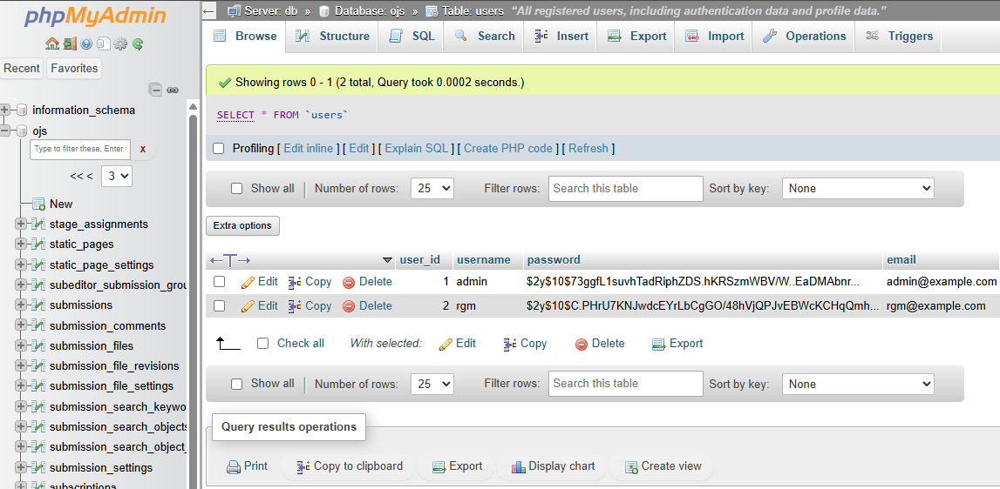</a> |
| Mailpit | Captures emails sent by OJS, at http://localhost:8082 by default | `docker-compose.yml`, `.env`, `config/override.config.inc.ini` (SMTP config appended to `config.inc.php`), `Dockerfile` | <a href="docs/images/readme/mailpit.png">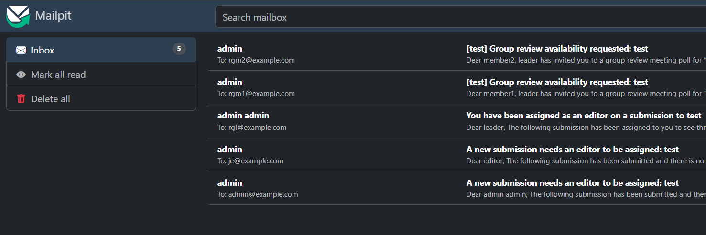</a> |

## 4. Workflows

### Modifying UI (.tpl, .css)

1. Make edits to files in `groupReview/`
2. Refresh the browser

No command needed, this is picked up live by the container.

### Running database migrations

1. Make edits to GroupReviewMigration.php
2. Run command
```
docker exec -it ojsdev_app php lib/pkp/tools/installPluginVersion.php plugins/generic/groupReview/version.xml
```

### Checking before a pull request

CI runs these on every push.

**PHP syntax check**
```
git ls-files '*.php' | xargs -I{} php -l {}
```

**Code style** (php-cs-fixer)
```
vendor/bin/php-cs-fixer fix --dry-run --diff --config=.php-cs-fixer.php
```

**Static analysis** (PHPStan)
```
vendor/bin/phpstan analyse --no-progress
```

## 5. Common commands

| Command | What it does |
| --- | --- |
| `docker compose up -d` | Start containers |
| `docker compose up --build -d` | Rebuild the app image, only needed after changing `Dockerfile` |
| `docker compose down` | Stop and remove containers |
| `docker compose down -v` | Also wipe volumes (fresh database, fresh uploaded files) |
| `docker compose ps` | List running containers |
| `docker compose logs -f app` | Tail app container logs |
| `docker compose restart app` | Restart app container |
| `docker exec -it ojsdev_app bash` | Shell into the app container |
| `docker exec -it ojsdev_app php lib/pkp/tools/installPluginVersion.php plugins/generic/groupReview/version.xml` | Rerun the plugin's DB migration after editing `GroupReviewMigration.php` |
| `docker exec -it ojsdev_db mariadb -u ojsdev -p ojs` | MySQL shell on the OJS database |
| `composer install` | Install this repo's dev dependencies |
| `composer install -d ojs-src/lib/pkp --ignore-platform-reqs` | Install OJS core's dependencies |
| `./install.sh` | Run the automated OJS install |

## 6. Plugin usage

### Create test users

http://localhost:8080/test/management/settings/access#users

An editor with the role "Journal editor"

A review group leader with the role "Review Group Leader"

Two review group members with the role "Review Group Member"

You can later log in as these users also

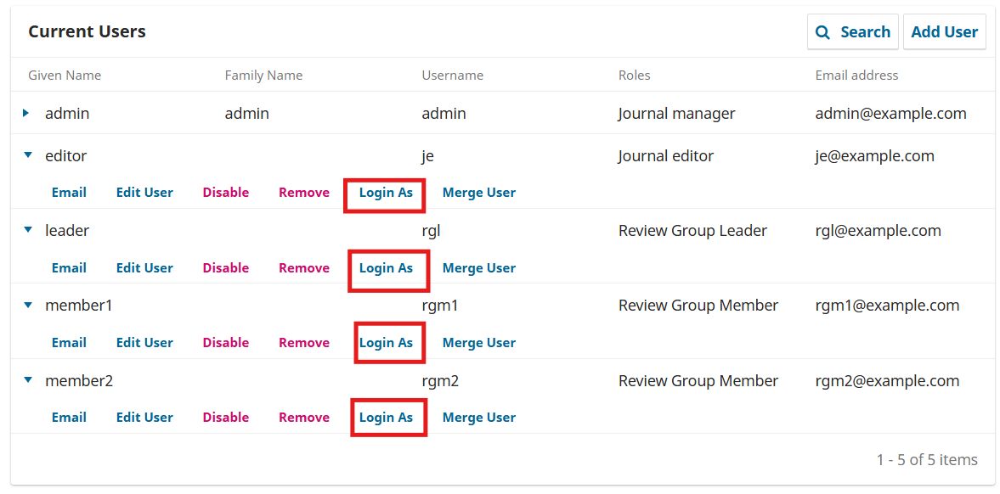

### Create test submission and send for review

http://localhost:8080/test/submissions

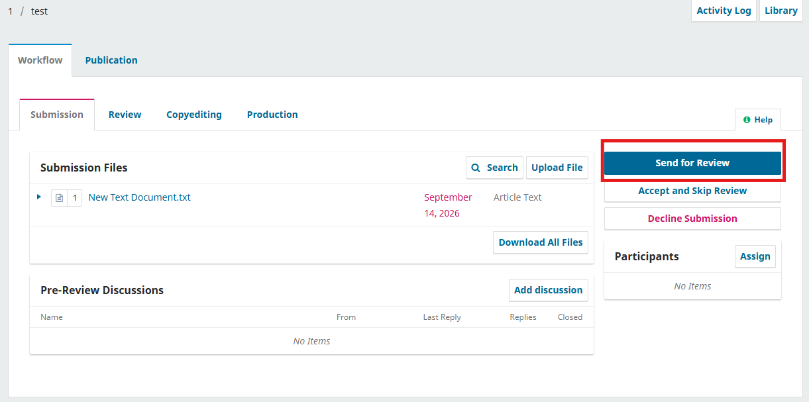

### Assign RGL as participant to submission

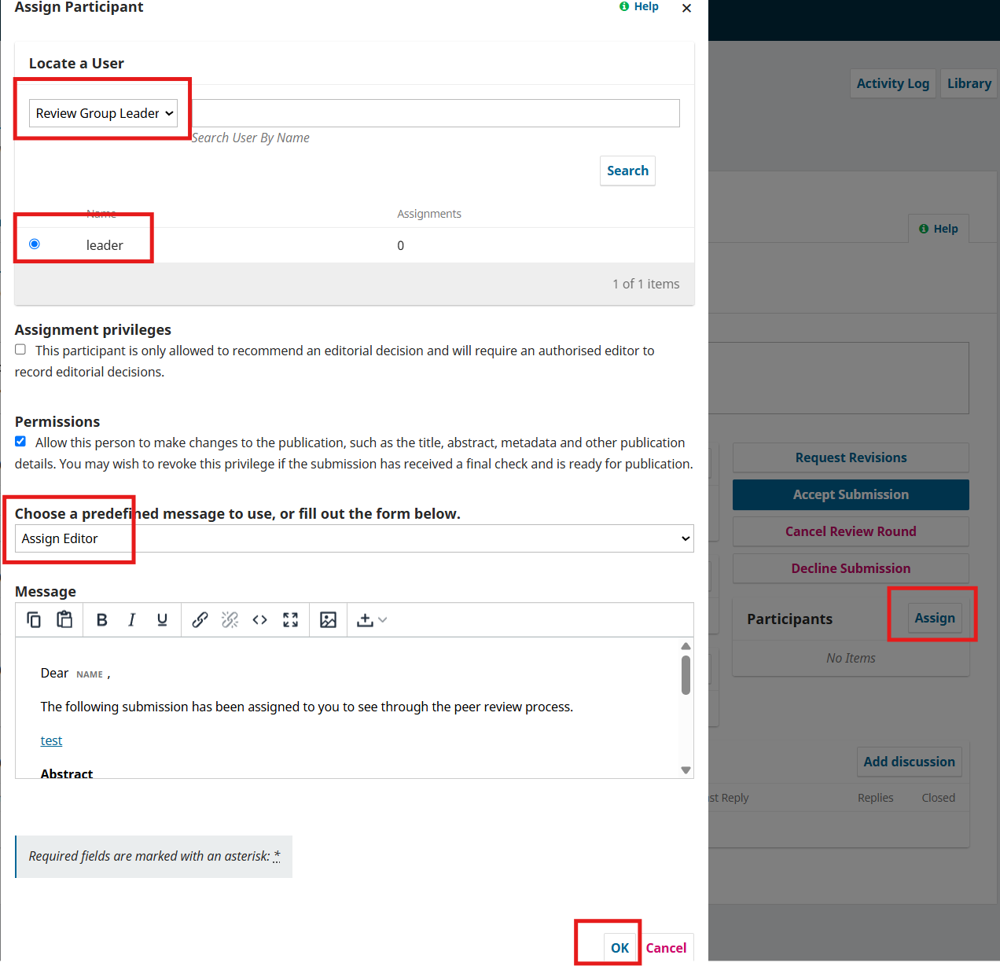

### Login as RGL

Login as RGL from: http://localhost:8080/test/management/settings/access#users

Go to the submission and click on the "Group Review" tab, which confirms the plugin is working

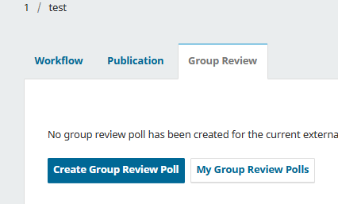
