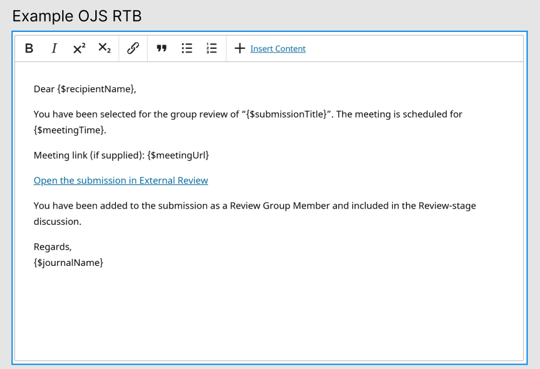
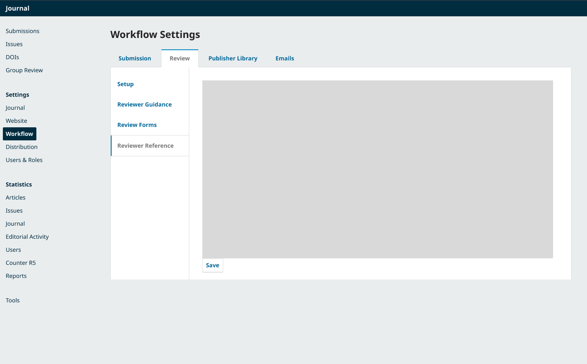
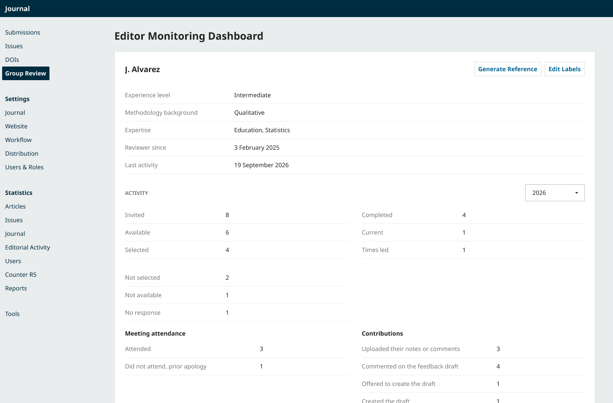
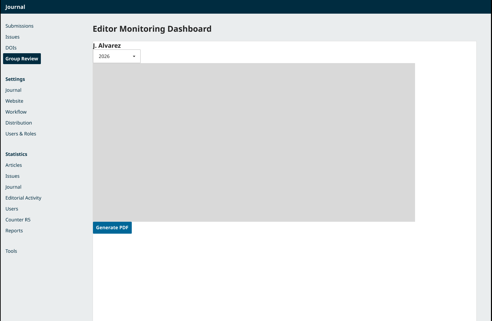

# Reference Generator Wireframe Validation

**Creator by:** Jahan Haidari (BA)

**Team:** 77

**Task:** Validation of reference generator wireframes

---

## 1. Task Scope

This document validates the reference generator wireframes against the requirements document. The wireframes were produced by UX and show the flow for configuring a reference template, generating a reference from the reviewer page, and previewing the output.

The validation checks whether each requirement is met and identifies any gaps or missing items before sign off.

---

## 2. Screens Reviewed

### 2.1 Workflow Settings — Reviewer Reference Tab

The template configuration screen where editors set up the reference letter template.

### 2.2 Configure Template

The template editor showing how editors configure the reference letter content using placeholders.

### 2.3 Reviewer Page with Generate Reference Button

The reviewer page in the Editor Monitoring Dashboard with the Generate Reference button visible in the top right.

### 2.4 Generate Reference Screen

The generation screen with a year selector, Generate PDF button, and a preview area.

---

## 3. Field by Field Validation

### 3.1 Button Placement and Visibility

| Requirement | Status | Evidence                                                                                                                        |
|-------------|--------|---------------------------------------------------------------------------------------------------------------------------------|
| Generate Reference button appears on reviewer page | Pass   | Visible in screen 2.3, top right next to Edit Labels                                                                            |
| Button only visible to Managing Editors and Quality Review Editors | Pass   | Wireframes do not show role-based views but its common sense only those too users have access to the reference generator button |

The button is placed where editors will expect it. However, no wireframe shows what other roles see. The requirements state that only Managing Editors and Quality Review Editors should see the button.

### 3.2 Year Selector

| Requirement | Status | Evidence |
|-------------|--------|----------|
| Year selector present on generation screen | Pass   | Visible in screen 2.4, shows 2026 |
| All time option available | Pass   | Only 2026 shown in the wireframe |

The year selector is in the right place. The wireframe does not show whether All time is an option, which the requirements ask for.

### 3.3 Preview and Download

| Requirement | Status | Evidence |
|-------------|--------|----------|
| Preview of generated letter | Pass | Grey preview area shown in screen |
| PDF download option | Pass | Generate PDF button visible in screen |

The preview area is present but empty in the wireframe. It does not show what the actual letter looks like. The Word format is missing entirely.

### 3.4 Letter Structure and Content

| Requirement | Status | Evidence                                                                                                                                                                                                    |
|-------------|--------|-------------------------------------------------------------------------------------------------------------------------------------------------------------------------------------------------------------|
| Letter structure matches client example | Pass   | No preview of actual letter text because its just an example letteractual design should contain the original client letter                                                                                  |
| Data mapping from reviewer page | Pass   | The variables of the reference letter will be generated from the data in the reviewer page                                                                                                                  |
| Engagement bullet list built from records | Pass   | The generator doesn't just paste a fixed list of bullets into every letter it looks at the reviewer's records for the chosen year and only includes the bullets that match what that reviewer actually did. |

As per the requirements state that the letter should follow the structure of the client's example, with an introduction, review counts, leadership context, engagement bullets, character statement, and sign off. In the wireframes we are using examples the actual reference generator should use clients actual end of year reference letter structure.

### 3.5 Editing the Closing Statement

| Requirement | Status | Evidence |
|-------------|--------|----------|
| Editor can edit the closing statement | Partial | Template editor in screen 2.2 could cover this, but not clearly |

The template editor allows editing the template itself. It is not clear whether the editor can edit the closing statement per reviewer at generation time, or only the template globally.

---

## 4. Gaps Found

| Gap | Severity | Recommendation |
|-----|----------|----------------|
| Role-based visibility not shown | Medium | Add notes to the wireframe explaining button visibility for each role |
| Editing the closing statement unclear | Medium | Clarify whether this happens in the template editor or at generation time |
| Template editor behaviour unclear | Medium | Show whether editors can add, remove, or reorder sections |
| All time option for year selector | Low | Confirm whether All time is included |

---

## 5. What Works Well

The wireframes introduce a template editor for the reviewer reference. This is a good addition. It means editors can adjust the reference letter to match their journal's tone without needing code changes.

The use of placeholder variables like `${recipientName}`, `${submissionTitle}`, and `${journalName}` follows the same pattern OJS uses for its own email templates. That is a consistent design choice.

Putting the Generate Reference button right next to Edit Labels on the reviewer page is a sensible location. Editors will find it exactly where they are already looking at the reviewer's data.

The year selector on the generation screen gives editors control over the time range without cluttering the reviewer page itself.

---

## 6. Recommendations for UX

| Item | Priority            |
|------|---------------------|
| Add a wireframe showing the generated letter preview with real sample content | High                |
| Add notes showing button visibility per role | Already implemented |
| Clarify how the closing statement is edited | Medium              |
| Show how the template editor handles adding or removing sections | Medium              |
| Confirm whether All time is available in the year selector | Low                 |

---

## 7. Overall Verdict

The wireframes are a good first draft with example visuals. They cover the main flow from template configuration, to the reviewer page, to generating and previewing the letter.

---

## 8. Sign Off

| Role | Name | Status                     | Date |
|------|------|----------------------------|------|
| BA | Jahan Haidari | Approved feedback provided | 8 October 2026 |

---
