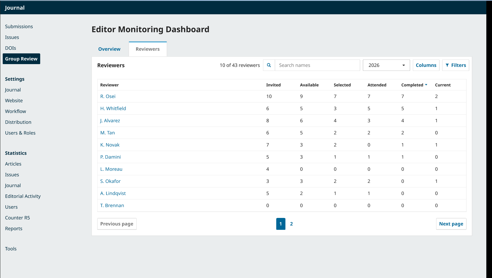
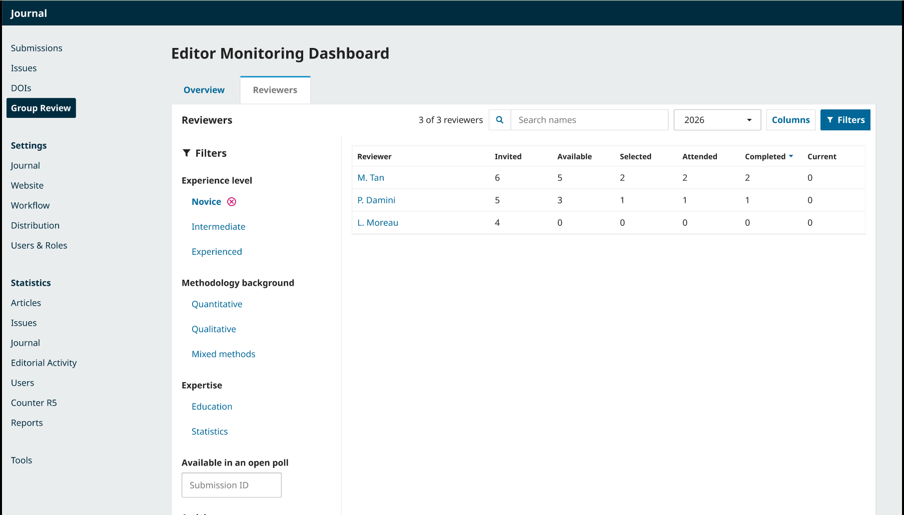
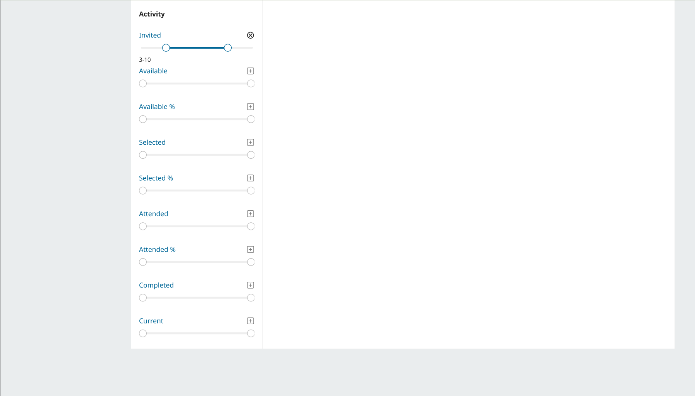
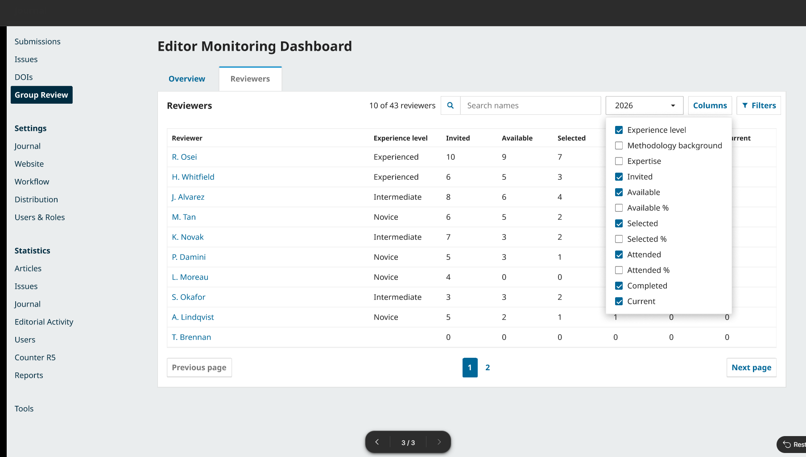

# Reviewer Filtering Wireframe Validation

**Creator by:** Jahan Haidari (BA)

**Team:** 77

**Task:** Validation of further reviewer filtering wireframes

---

## 1. Scope of Task

This document validates the reviewer filtering wireframes against the filtering requirements document. The wireframes were produced by UX and show how editors filter the Reviewers table in the Editor Monitoring Dashboard.

---

## 2. Screens Reviewed

### 2.1 Reviewers Page Main View

The Reviewers page with the search box, year selector, Columns button, Filters button, and the reviewer table.

### 2.2 Filters Panel — Label Filters and Available in an Open Poll

The filter panel showing label filters for experience level, methodology background, and expertise, plus the Available in an open poll filter.

### 2.3 Filters Panel — Activity Range Filters

The filter panel showing the Activity section with value range sliders for each column.

### 2.4 Columns Dropdown

The Columns button showing the list of column checkboxes.

---

## 3. Field by Field Validation

### 3.1 Label Filters

| Requirement | Status | Evidence |
|-------------|--------|----------|
| Experience level filter | Pass | Visible in screen 2.2 with Novice, Intermediate, Experienced |
| Methodology background filter | Pass | Visible in screen 2.2 with Quantitative, Qualitative, Mixed methods |
| Expertise filter | Pass | Visible in screen 2.2 with Education, Statistics |
| Selected filter can be cleared | Pass | Novice shows an X icon next to it in screen 2.2 |

### 3.2 Available in an Open Poll Filter

| Requirement | Status | Evidence                                                                |
|-------------|--------|-------------------------------------------------------------------------|
| Submission ID input present | Pass   | Visible at the top of the filter panel in screen 2.2                    |
| Only available reviewers for that poll shown | Pass   | The wireframe shows the input, the filtered results should reflect that |

### 3.3 Number Filters

| Requirement | Status | Evidence |
|-------------|--------|----------|
| Value range can be set on a column | Pass | Screen 2.3 shows dual-handle sliders for Invited, Available, Available %, Selected, Selected %, Attended, Attended %, Completed, and Current |
| Invited slider shows active range | Pass | Screen 2.3 shows Invited set to 3-10 with an X to clear |
| Range can be expanded with a + icon | Pass | Each unset slider has a + icon |
| No reviews done can be found with Completed 0-0 | Pass | The Completed slider exists and can be set to 0-0 |

### 3.4 Combined Filters

| Requirement | Status | Evidence |
|-------------|--------|----------|
| Multiple filters can be applied at the same time | Pass | Label filters, Available in an open poll, and Activity range sliders appear in the same panel |
| Only reviewers matching the applied filters appear | Pass | Screen 2.2 shows 3 of 3 reviewers after applying the Novice filter |

### 3.5 Sorting With Filters

| Requirement | Status | Evidence |
|-------------|--------|----------|
| Sorting works on filtered list | Pass | Sort arrow on Completed column visible in screen 2.1 |

### 3.6 Clearing Filters

| Requirement | Status | Evidence |
|-------------|--------|----------|
| Each filter can be cleared individually | Pass | X icon on the Novice label filter and on the Invited slider |

---

## 4. Gaps Found

No gaps found. Every requirement in the filtering requirements document is represented in the wireframes.

One item to keep an eye on: the Available in an open poll filter shows the input but not what happens after it is used. The implementation should show the filtered results too.

---

## 5. What Works Well

The label filters and the activity range filters are both in the same side panel. Editors can set labels, availability, and ranges without switching screens.

The range sliders use a familiar pattern. The dual-handle slider shows the current range as text underneath, for example "3-10" for Invited.

Unset sliders have a + icon and a greyed appearance, so editors can see at a glance which filters are active and which are not.

Active filters have an X to clear them individually, which makes it easy to reset a single filter without losing the others.

The live reviewer count updates when a filter is applied. The count went from "10 of 43 reviewers" to "3 of 3 reviewers" when the Novice filter was selected.

The sort indicator on the Completed column is visible in the main view, so sorting works alongside the filters.

The Columns button lets editors choose which columns to see. It is a nice usability addition, not a filter, and does not need to be in the requirements.

---

## 6. Overall Observation and Decision

The wireframes meet the client's requirements. The label filters, the Available in an open poll filter, and the number range filters are all present.

The wireframes are ready for sign off.

---

## 7. Recommendations for UX

| Item | Priority |
|------|----------|
| Add a wireframe showing the result after using the Available in an open poll filter | Low |

---

## 8. Sign Off

| Role | Name | Status | Date |
|------|------|--------|------|
| BA | Jahan Haidari | Approved | 8 October 2026 |

---