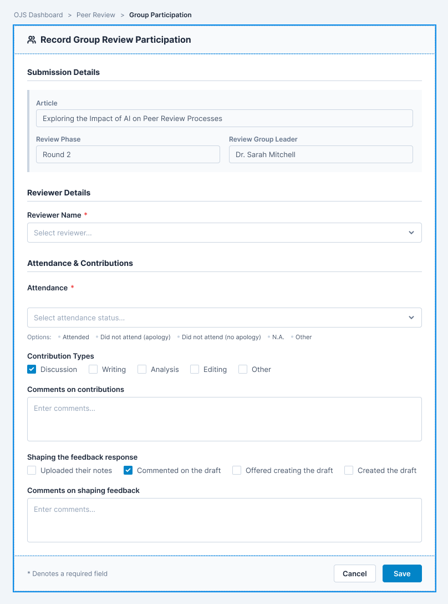

# Reviewer Participation Recording Requirements

**Prepared by:** Jahan Haidari (BA)
**Team:** 77

---

## 1. General Information

This document defines what data needs to be recorded during group review meetings and who is responsible for recording it. This feature is Tool 1 from the project proposal and replaces the current Microsoft Form that Review Group Leaders fill out after meetings.

### The Core Problem

Currently, Review Group Leaders fill out a separate Microsoft Form after each group review meeting to record reviewer attendance, contributions, strengths, and development opportunities. This form is disconnected from OJS, which means data must be entered manually and is not linked to reviewer profiles or submission records.

This feature solves that by integrating the form directly into OJS as part of the plugin.

---
Keep in mind: This document focuses on the functional requirements. The visual design will be handled by UX.
The mockup in this document is only a reference to show what the form could look like and can be changed by UX and the UX will produce the actual designs.
### Visual comparison of current process vs our integration idea
### Now!

### After!

## Form location
The form will be accessible from the **Review stage** of a submission, attached to the **Group review tab**.
The RGL will fill out **one form per review group** not per reviewer. The form will have?
- Columns for each review group leader
- Rows for each evaluation criteria
- Temporary save option

## Feature 2 Requirements
## 2. Data Fields to Record

The following data fields will be captured during or after the group review meeting. This replaces the current Microsoft Form.

| Data Field | Description | Input Type                         |
|------------|-------------|------------------------------------|
| Article number and first author | Submission being reviewed | Autofilled from OJS                |
| Review phase | Which review round, for example first or second round | Dropdown                           |
| Review Group Leader name | Name of the Review Group Leader | Autofilled from OJS                |
| Reviewer name | Name of the reviewer being evaluated | Dropdown (select from group members) |
| Attendance | Whether the reviewer attended the meeting | Dropdown                           |
| Contribution types | What the reviewer contributed to the meeting | Checkboxes                         |
| Comments on contributions | Strengths and development opportunities | Free text                          |
| Shaping the feedback response | How the reviewer contributed to the report | Checkboxes                         |
| Comments on shaping feedback | Additional notes on contributions | Free text                          |

---

## 3. Attendance Options

| Option | Description |
|--------|-------------|
| Attended | The reviewer attended the meeting |
| Did not attend with apology | The reviewer gave prior notice of absence |
| Did not attend without apology | The reviewer did not attend and did not give notice |
| N.A. | Not applicable, for example if no meeting was held |
| Other | Other circumstances not covered by the above |

---

## 4. Contribution Types

| Option | Description |
|--------|-------------|
| Discussion | Contributed to verbal discussion during the meeting |
| Writing | Contributed to written portions of the review |
| Analysis | Contributed analytical input |
| Editing | Contributed to editing or refining the review |
| Other | Other contributions not covered by the above |

---

## 5. Shaping the Feedback Response Options

| Option | Description |
|--------|-------------|
| Uploaded their notes or comments | Provided written input before or during the meeting |
| Commented on the feedback draft | Provided feedback on the draft review report |
| Offered creating the draft | Was willing to create the draft, even if not selected |
| Created the draft | Actually created the draft review report |

---

## 6. Who Needs to Record It

| Role | What They Record | When |
|------|------------------|------|
| Review Group Leader | One form per review group (columns for each RGM, rows for criteria) | During or immediately after the group review meeting with option to save and return later |
| Managing Editor | Can view all records | Any time (from submission review stage or dashboard) |
| Quality Review Editor | Can view all records | Any time (from submission review stage or dashboard) |
| Review Group Member | Can view their own records only | Any time |
| Reviewer | Can view their own records only | Any time |

---

## 7. Problem It Solves

| Problem | Solution |
|---------|----------|
| Microsoft Form is disconnected from OJS | Form is integrated directly into OJS |
| Manual data entry | Data is entered once and stored in OJS |
| Data is not linked to reviewer profiles | Data is stored against the reviewer's profile |
| Data is not linked to submissions | Data is linked to the specific submission |
| Hard to retrieve historical data | Data is stored in OJS and easily accessible |
| Hard to identify reviewer strengths and development needs | Data is captured consistently and can be viewed over time |

---

## 8. User Stories

### Review Group Leader

As a Review Group Leader, I want to record reviewer attendance after the meeting so that I can track who attended.

As a Review Group Leader, I want to record contribution types for each reviewer so that I can capture what they contributed to the review.

As a Review Group Leader, I want to record strengths and development opportunities so that I can provide meaningful feedback.

As a Review Group Leader, I want to record shaping feedback responses so that I can track who contributed to the review report.

As a Review Group Leader, I want to complete the form within OJS so that I do not have to use an external Microsoft Form.

### Managing Editor

As a Managing Editor, I want to view reviewer participation records so that I can assess reviewer engagement and development needs.

### Quality Review Editor

As a Quality Review Editor, I want to view reviewer participation records so that I can identify development needs and support reviewers.

### Reviewer

As a Reviewer, I want to view my own participation records so that I can track my contributions and development.

---

## 9. Roles and Permissions

| Role | Can View | Can Record | Can Edit |
|------|----------|------------|----------|
| Review Group Leader | Records for reviewers they evaluated | All data for their group | Data they recorded before submission |
| Managing Editor | All data | No | All records |
| Quality Review Editor | All data | No | All records |
| Review Group Member | Their own records only | No | No |
| Reviewer | Their own records only | No | No |

---

## 10. Acceptance Criteria

| Number | Acceptance Criteria                                                                                                                                   |
|--------|-------------------------------------------------------------------------------------------------------------------------------------------------------|
| 1 | Review Group Leader can select a submission to record participation for                                                                               |
| 2 | Article number and first author are autofilled from OJS                                                                                               |
| 3 | Review Group Leader name is autofilled from OJS                                                                                                       |
| 4 | Review Group Leader can select a reviewer name from the group members                                                                                 |
| 5 | Review Group Leader can record attendance with options for Attended, Did not attend with apology, Did not attend without apology, N.A., or Other      |
| 6 | Review Group Leader can record contribution types including Discussion, Writing, Analysis, Editing, and Other                                         |
| 7 | Review Group Leader can record strengths as free text                                                                                                 |
| 8 | Review Group Leader can record development opportunities as free text                                                                                 |
| 9 | Review Group Leader can record shaping feedback responses including Uploaded notes, Commented on draft, Offered creating the draft, or Created the draft |
| 10 | Review Group Leader can record comments on shaping feedback as free text                                                                              |
| 11 | All data is stored in OJS and linked to the reviewer's profile                                                                                        |
| 12 | All data is linked to the specific submission                                                                                                         |
| 13 | The Microsoft Form is replaced by the inplugin form                                                                                                   |
| 14 | RGL can temporarily save the form and return to it later |
| 15 | All submitted forms have a data stamp showing when they were last edited |

---

## 11. Assumptions

1. All reviewers have a valid OJS user account.

2. OJS can store custom data fields for reviewers.

3. Review Group Leaders will record data during or immediately after meetings.

4. The feature will integrate with existing OJS submission data.

5. Reviewers have access to view their own records.

6. Historical data from the Microsoft Form will not be migrated.
7. Review group leaders can access and edit previously submitted forms (with data stamp).
8. Only managing editors and quality review editors can edit records so RGL's cannot edit after submission.

---

## 12. Open Questions

| Number | Question | Who to Ask   |
|--------|----------|--------------|
| 1 | Should Review Group Leaders be able to edit records after submission | Client Eva |
| 2 | Should Managing Editors be able to edit records | Client Eva |
| 3 | Should the form include any additional fields not covered here | Client   Eva |
| 4 | Should RGLs be able to edit forms after submission? | Client Eva |
| 5 | Should editing have a date stamp visible to editors? | Client Eva |

---

## 13. Future Considerations

1. This data will feed into Tool 2, the Editor Monitoring Dashboard.

2. This data will feed into Tool 3, the Reference Generator.

3. Future enhancements may include bulk entry for multiple reviewers at once.

## 14. Configurable Fields
Editors will manage which fields are configurable through journal settings.
**Configurable options:**
- Which fields are required vs optional
- Which contribution types are available
- Which attendence options are available
- Which shaping feedback options are available

**Additional fields:**
- An **'other' field** per RGM (free text) for additional comments
- A **general comments fields** for the RGL to communicate ideas and suggestions to editors

**Our current assumptions**
|Assumptions | Status |
|------------|--------|
| Contribution types are fixed (Discussion, writing, analysis and editing | To be confirmed with Eva |
| Attendence options are fixed | To be confirmed with Eva |
| Shaping feedback options are fixed | To be confirmed with Eva |
| Editors can change field requirements (reuqired vs optionl) | To be confirmed with Eva |

