# Current Reviewer Tracking Process ASRHE Journal

**Prepared by:** Jahan Haidari (BA)   
**Team:** 77  
**Task:** 1.7 Document current manual reviewer tracking processes week1 sprint1

---

## 1. Overview

The ASRHE journal uses a **group review process** rather than the standard OJS review workflow. This document maps the current process, identifies what OJS and the existing plugin handle, and documents what is still done manually outside the system.

---

## 2. OJS Admin Dashboard

The admin dashboard is the starting point for managing the journal:

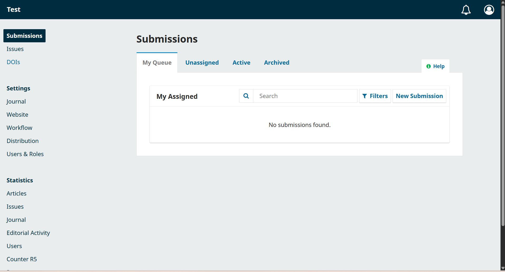

**Key features:**
- Create and manage journals
- Add and assign user roles
- Configure system settings

---

## 3. Creating a Journal

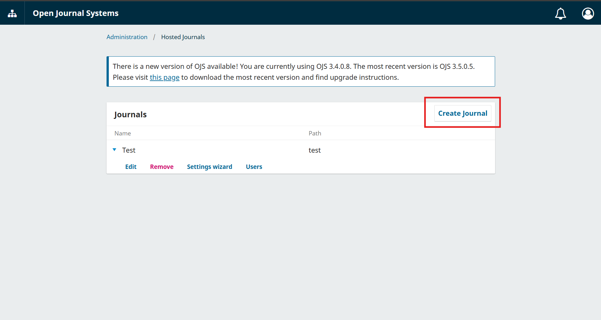

**Steps to create a journal:**
1. Navigate to Administration → Hosted Journals
2. Click "Create Journal"
3. Enter journal title, initials, and contact details
4. Journal is created and ready for submissions

---

## 4. User Roles and Permissions

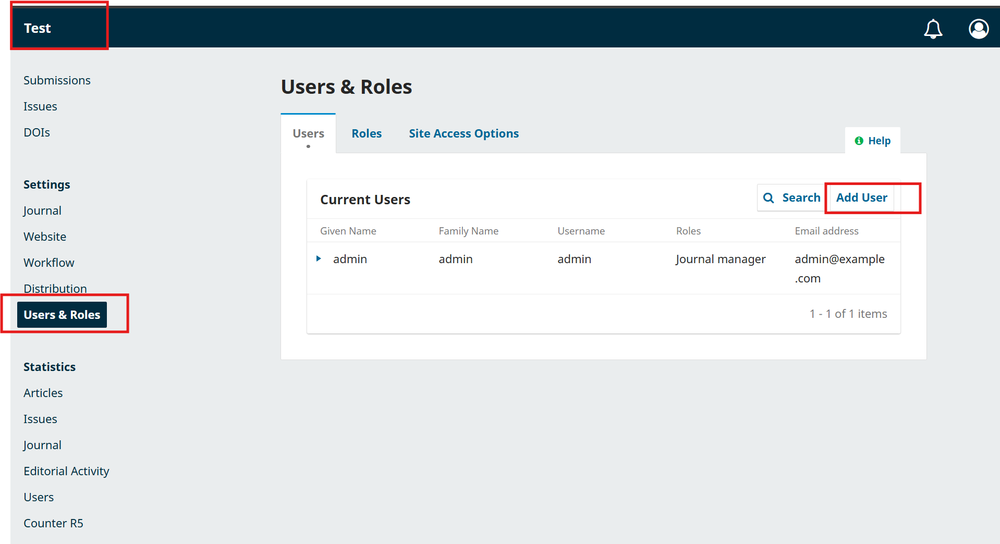

**Roles in the review process:**

| Role | Responsibilities |
|------|------------------|
| **Admin** | System configuration, creating journals, managing users |
| **Managing Editor** | Oversee review process, assign reviewers, make decisions |
| **Review Group Leader** | Lead group review meetings, record participation |
| **Quality Review Editor** | Ensure quality control, follow up with reviewers |
| **Reviewer** | Review submissions, provide feedback |

---

## 5. Submission Workflow

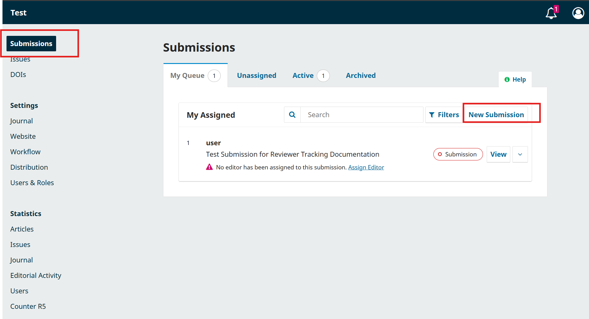

**Current process (inside OJS):**
1. Author submits manuscript
2. Editor assigns to reviewers
3. Reviewers submit feedback
4. Editor makes decision

**What the existing plugin handles:**
- Group review structure
- Basic reviewer participation recording

---

## 6. Reviewer Assignment

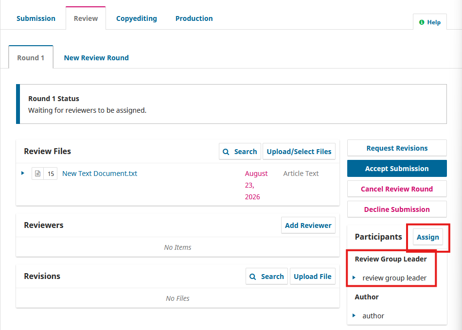

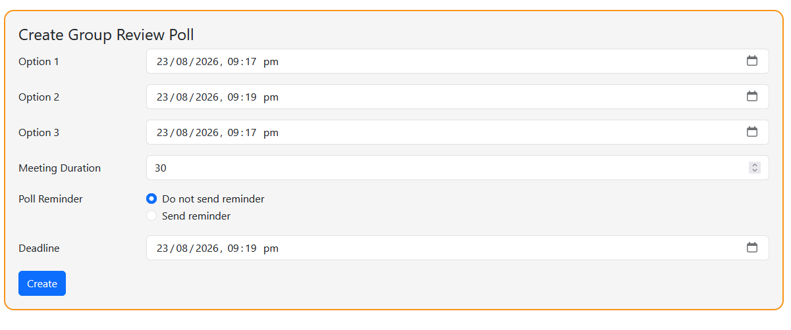
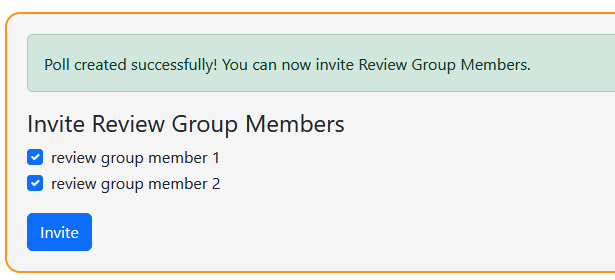
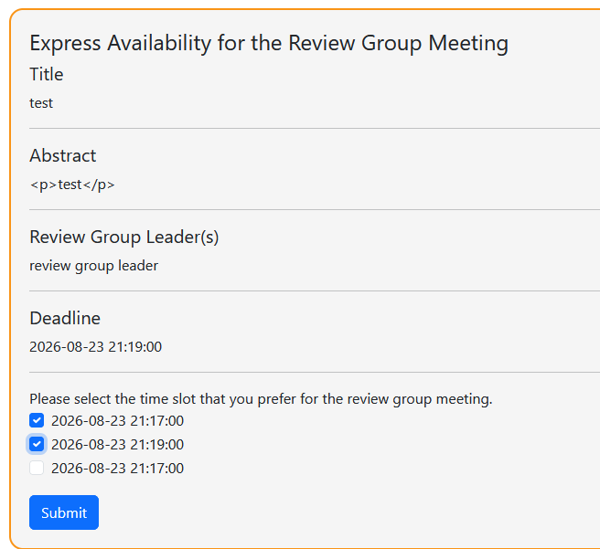
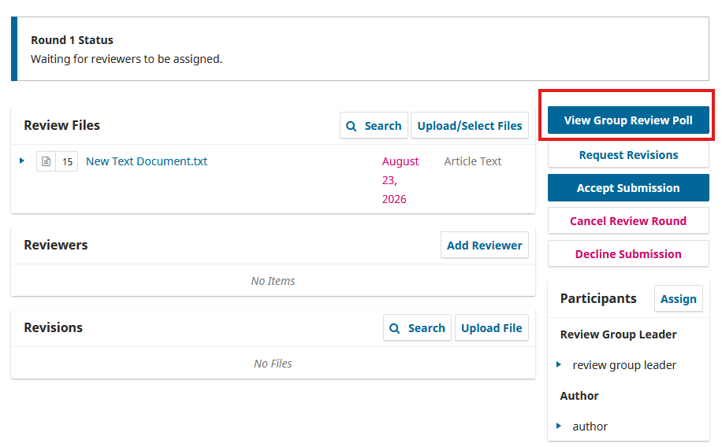
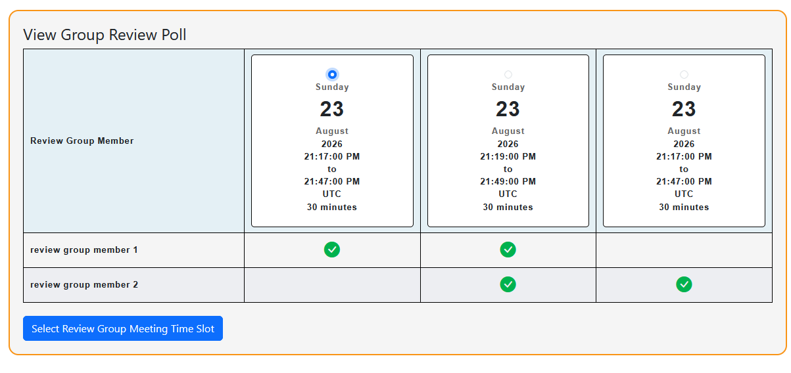
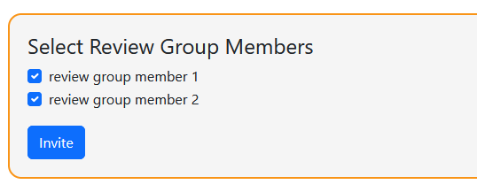
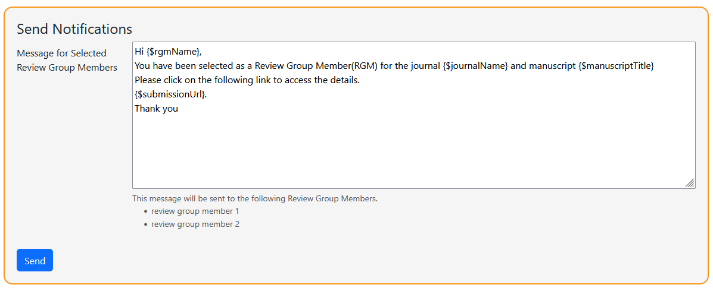
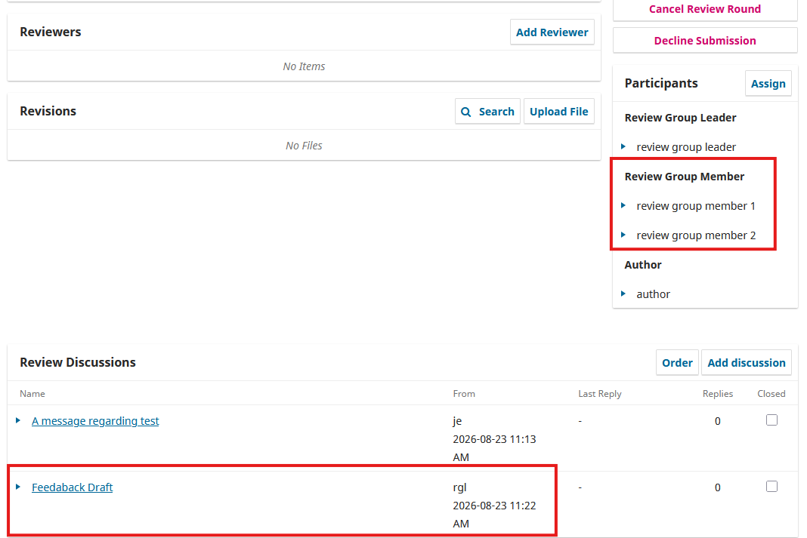

**How reviewers are currently assigned:**
- General editor moves manuescript to review stage, adds chosen Review group leader
- RGL creates poll with date/time options
- RGl invites RGMs to poll
- RGMs express availability
- RGL selects time plus subset of RGMs
- Plagin adds RGM as participants, creates feedback discussion

---

## 7. Group Review Plugin Status

**Open Journal Systems (OJS) does not currently have a built-in or official plugin for group-based or collaborative peer review.**

The ASRHE journal uses a **group review process** that is not natively supported by OJS. Currently, this process is managed manually outside of the system.

### What Currently Happens

- Editors manually coordinate group reviews (via email)
- Reviewer participation is tracked in spreadsheets
- Data is not integrated with OJS
- Reporting and reference generation are manual

### Planned Solution

The ASRHE team is currently developing a custom plugin to support their group review process. This will include:

- **Tool 1:** Participation recording for group leaders
- **Tool 2:** Editor dashboard for monitoring reviewer contributions
- **Tool 3:** Automated reference generator

---

## 8. Manual Tracking (Outside OJS)

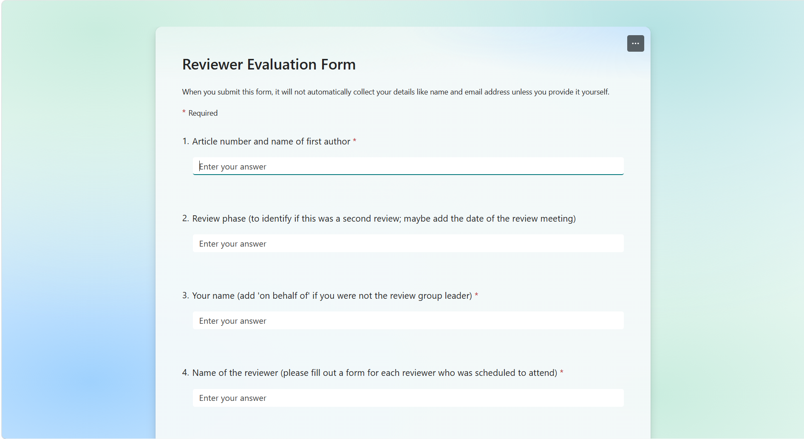

**What is currently done manually:**

| Activity | Tool Used | Pain Point |
|----------|-----------|------------|
| Recording attendance | Spreadsheet | Time-consuming, error-prone |
| Tracking contributions | Spreadsheet | No integration with OJS |
| Recording strengths/development | Spreadsheet | Data scattered |
| Generating annual references | Manual report | Takes hours to compile |
| Managing reviewer information | Spreadsheet + Forms | Difficult to aggregate |

---

## 9. Pain Points and Gaps

| Pain Point | Severity | Impact |
|------------|----------|--------|
| Manual data entry | High | Time-consuming, error-prone |
| No integration with OJS | High | Double data entry |
| No dashboard | High | Editors can't see reviewer workloads |
| No automated reports | Medium | End-of-year references take hours |
| Data scattered | Medium | Hard to get complete picture |
| No reviewer analytics | Medium | Can't identify top reviewers |

---

## 10. Open Questions for the Client

| Question | Who to Ask |
|----------|------------|
| What specific data fields are most important to track? | Managing Editor |
| How often are group review meetings held? | Group Leaders |
| Who currently maintains the spreadsheet? | Managing Editor |
| What reporting is needed at the end of the year? | Managing Editor |
| Are there any specific OJS version constraints? | Technical contact |
| What's the current process for generating reviewer references? | Managing Editor |
| What would make the process 10x better? | All stakeholders |

---
