# Quick Start: OJS & Existing Group Review Plugin

If you already have WSL/Linux and Docker set up, skip to [Installing OJS](#installing-ojs).

## WSL

In windows terminal as administrator

```plain
wsl --install -d Ubuntu-26.04
```

Set username and password.

## Docker Desktop

Install via terminal:

```plain
winget install Docker.DockerDesktop
```

In Docker Desktop go to **Settings → Resources → WSL Integration** and enable the Ubuntu distro. Then **Apply & Restart**.

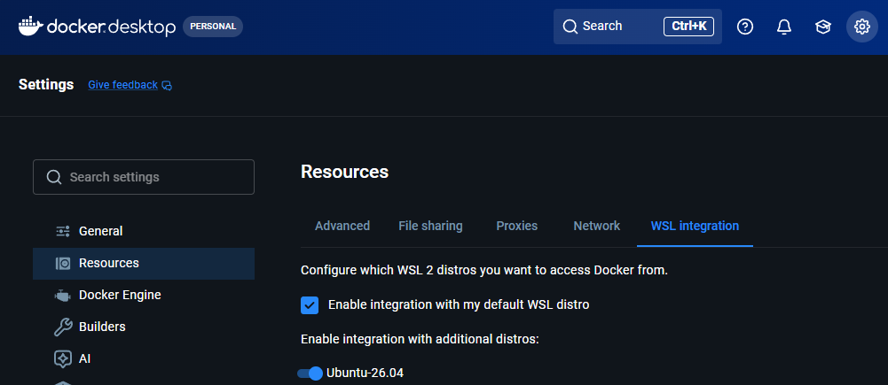

Relog into WSL and check you are in the `docker` group

```plain
groups
```

## Setting Up Containers

Clone and enter the containers repo:

```plain
git clone https://github.com/pkp/containers.git
cd containers/
```

Edit these values in `.env`:

```plain
PKP_VERSION="3_4_0-8"
IMAGE_SOURCE=pkpofficial
```

Download config:

```plain
source .env && wget "https://github.com/pkp/${PKP_TOOL}/raw/${PKP_VERSION}/config.TEMPLATE.inc.php" -O ./volumes/config/pkp.config.inc.php
```

Set permissions:

```plain
sudo chown 100:101 ./volumes -R
sudo chown 999:999 ./volumes/db -R
```

### Uncomment these volume mounts in `docker-compose.yml`

**db** volumes:

```yaml
volumes:
  - ./volumes/db:/var/lib/mysql
```

**app** volumes:

```yaml
volumes:
  - /etc/localtime:/etc/localtime
  - ./volumes/private:/var/www/files
  - ./volumes/public:/var/www/html/public
  - ./volumes/logs/app:/var/log/apache2
  - ./volumes/config/pkp.config.inc.php:/var/www/html/config.inc.php
  - ./volumes/config/php.custom.ini:/usr/local/etc/php/conf.d/custom.ini
```

Start the containers:

```plain
docker compose up -d
```

## Installing OJS

Open [http://localhost:8080](http://localhost:8080).

### Admin account

| Field | Value |
| --- | --- |
| Username | admin |
| Password | admin |
| Email | admin@example.com |

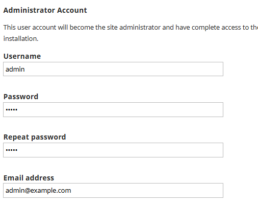

### Database settings

| Field | Value |
| --- | --- |
| Host | db |
| Username | pkp |
| Password | changeMePlease |
| Database name | pkp |

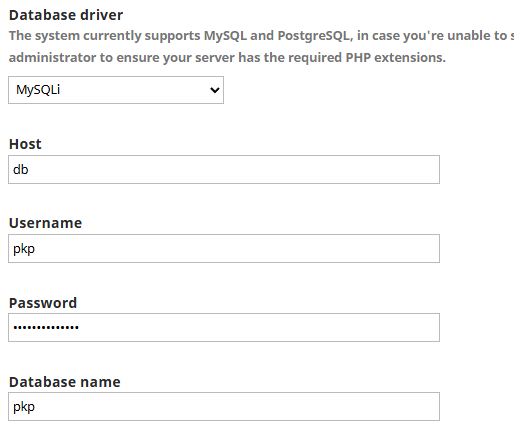

Click **Install Open Journal Systems**

Login with admin account at [http://localhost:8080/index.php/index/login](http://localhost:8080/index.php/index/login).

## Creating a Journal

Go to [http://localhost:8080/index.php/index/admin/contexts](http://localhost:8080/index.php/index/admin/contexts) and click **Create Journal**.

| Field | Value |
| --- | --- |
| Journal title | test |
| Journal initials | test |
| Principal contact name | admin |
| Principal contact email | admin@example.com |
| Country | Australia |
| Path | test |
| Enable | ✓ |

Journal will be at [http://localhost:8080/test/](http://localhost:8080/test/).

## Installing the Plugin

Go to **Dashboard → Settings → Website → Plugins** ([http://localhost:8080/test/management/settings/website#plugins](http://localhost:8080/test/management/settings/website#plugins)).

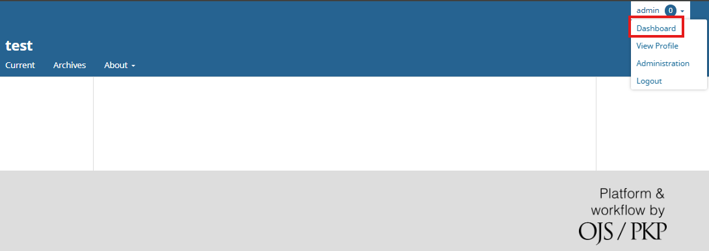

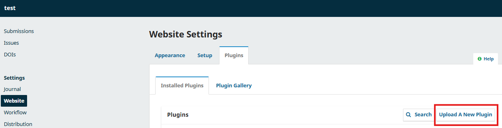

Upload `groupReview.zip` from the shared folder on teams. Find it under **Generic Plugins** and enable it.

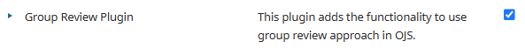

Go to **Settings → Workflow → Review** ([http://localhost:8080/test/management/settings/workflow#review](http://localhost:8080/test/management/settings/workflow#review)).

Enable the Group Review option. Scroll down and click **Save**.

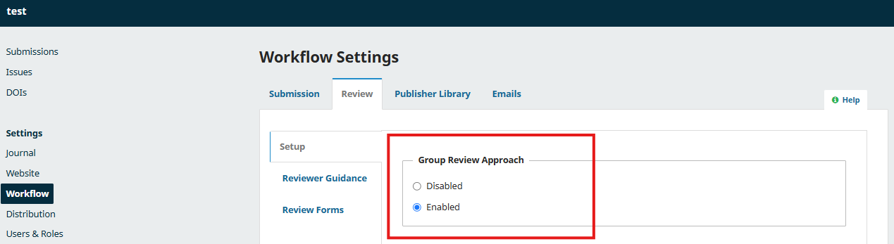

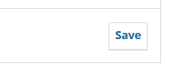

## Creating Roles

Go to **Settings → Users & Roles → Roles** ([http://localhost:8080/index.php/test/management/settings/access#roles](http://localhost:8080/index.php/test/management/settings/access#roles)) and click **Create New Role** for each:

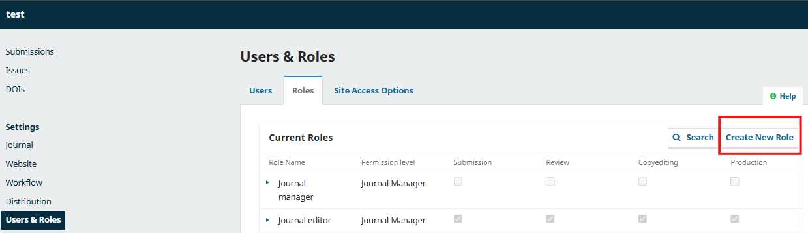

### Review Group Leader

| Field | Value |
| --- | --- |
| Permission level | Section Editor |
| Role name | Review Group Leader |
| Abbreviation | RGL |
| Stage assignments | Submission, Review, Copyediting |

### Review Group Member

| Field | Value |
| --- | --- |
| Permission level | Section Editor |
| Role name | Review Group Member |
| Abbreviation | RGM |
| Stage assignments | Submission, Review |

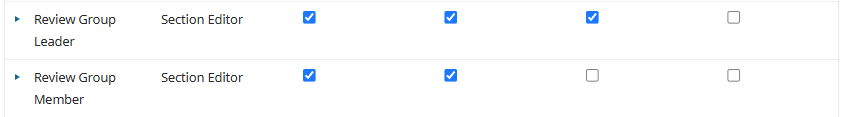

## Adding Test Users

Go to **Users & Roles → Users** and create each user:

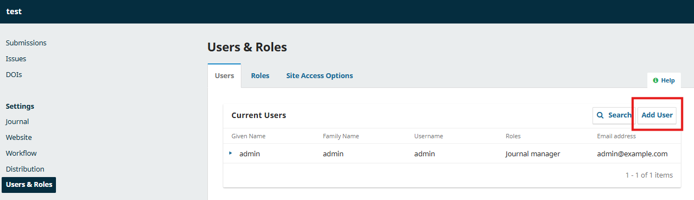

### Review Group Leader

| Field | Value |
| --- | --- |
| Name | leader |
| Username | rgl |
| Email | rgl@example.com |
| Password | leader |
| Change password on next login | ✗ |
| Role | Review Group Leader |

### Review Group Member

| Field | Value |
| --- | --- |
| Name | member |
| Username | rgm |
| Email | rgm@example.com |
| Password | member |
| Change password on next login | ✗ |
| Role | Review Group Member |

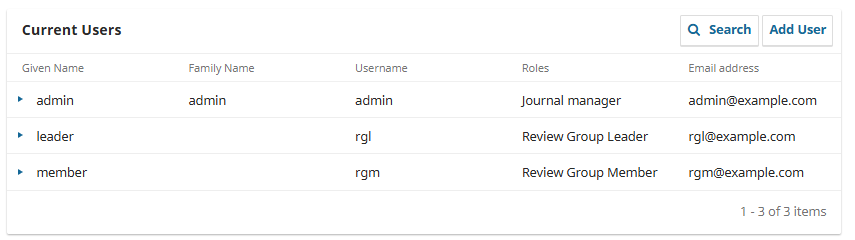

## Making a Test Submission

Go to [http://localhost:8080/test/submission](http://localhost:8080/test/submission).

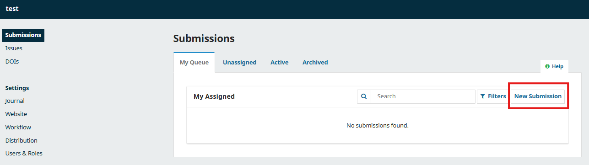

| Field | Value |
| --- | --- |
| Title | submission1 |
| Submission checklist | ✓ |
| Privacy consent | ✓ |
| Abstract | test submission abstract |

Upload an empty `.txt` file and mark it as **Article Text**.

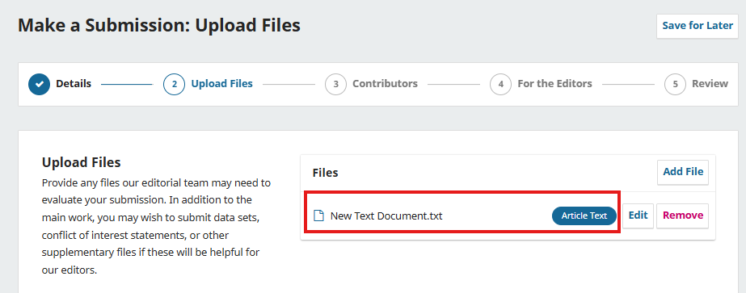

Add a contributor:

| Field | Value |
| --- | --- |
| Name | contributor1 |
| Email | contributor1@example.com |
| Country | Australia |

Continue through the remaining steps and submit.

## Sending for Review

View the submission at [http://localhost:8080/index.php/test/workflow/index/1/1](http://localhost:8080/index.php/test/workflow/index/1/1).

Click **Send for Review**.

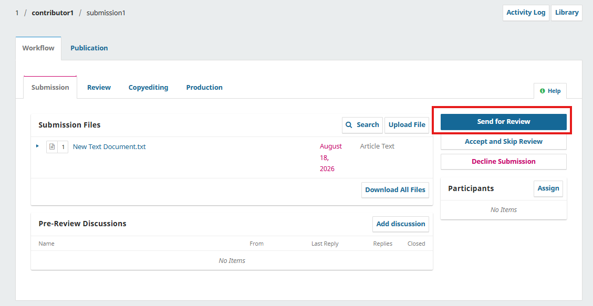

## Assigning the Review Group Leader

Go to the review stage: [http://localhost:8080/index.php/test/workflow/index/1/3](http://localhost:8080/index.php/test/workflow/index/1/3).

Click **Assign Participant**:

1. Locate a user: **Review Group Leader**
2. Select user: **leader**
3. Click **Assign**

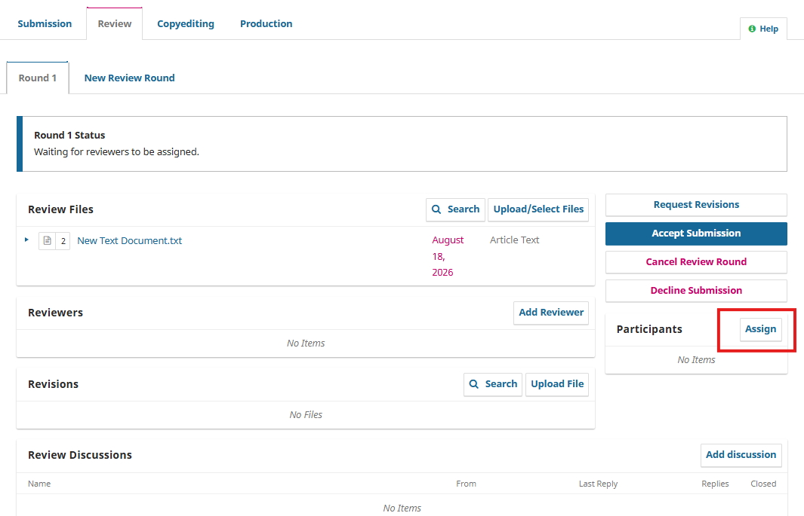

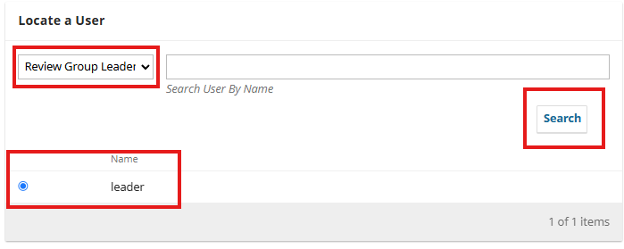

## Logging In as the Review Group Leader

Log out and log back in:

| Field | Value |
| --- | --- |
| Username | rgl |
| Password | leader |

You should see the assigned submission on the dashboard.

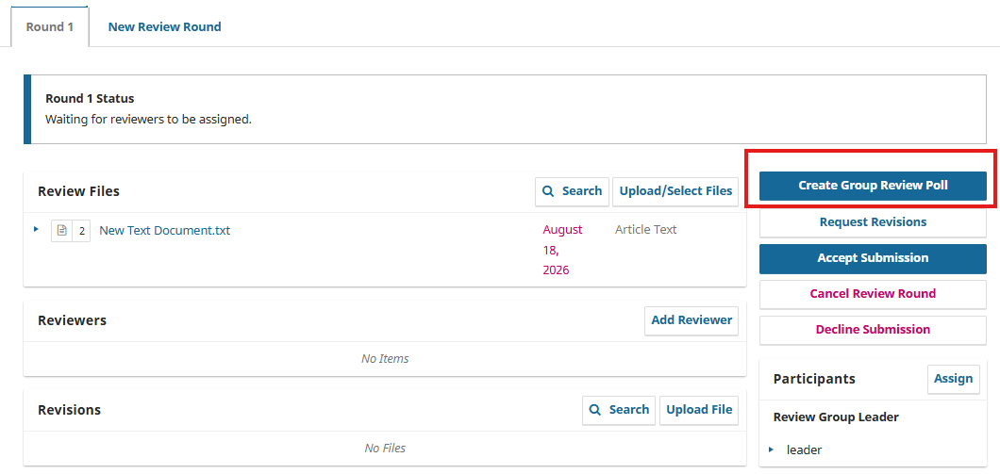